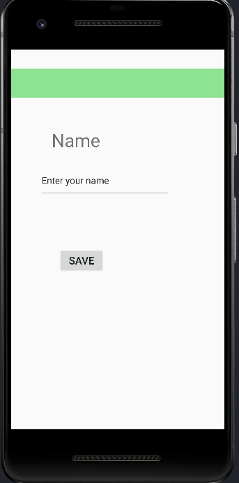
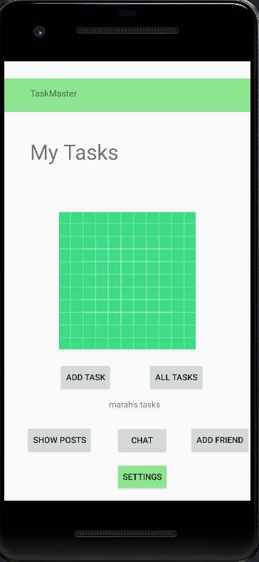
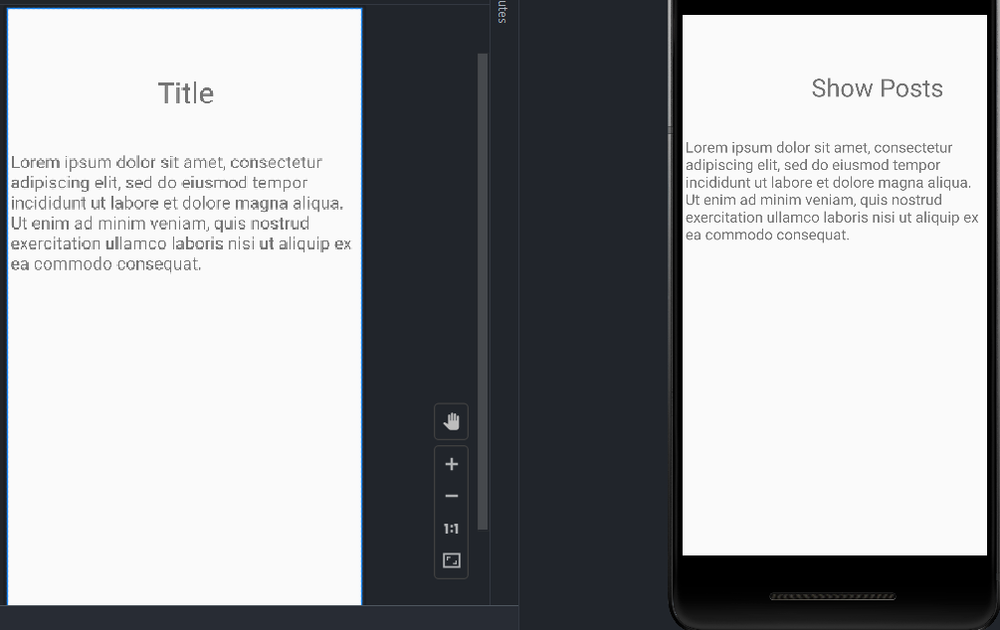
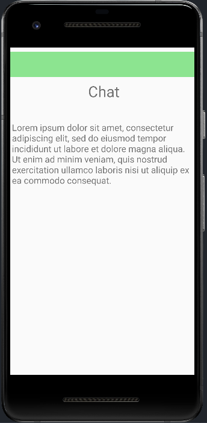

## Lab27

* Add 4 new buttons on the homepage (3 tasks and settings) and  2 other pages (settings and task detail).
* When the user enter his name on the settings page it will appear on the home page tasks title.
 * When he clicks on any task butoon he will be directed to the task detail page with the title of the task he cliked.

 

