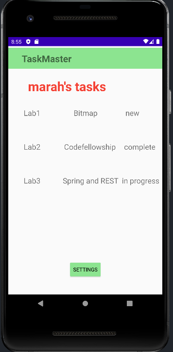
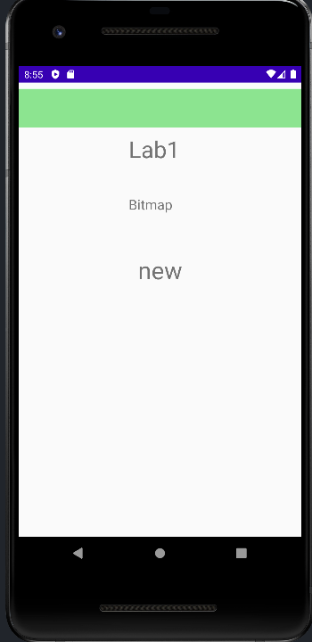
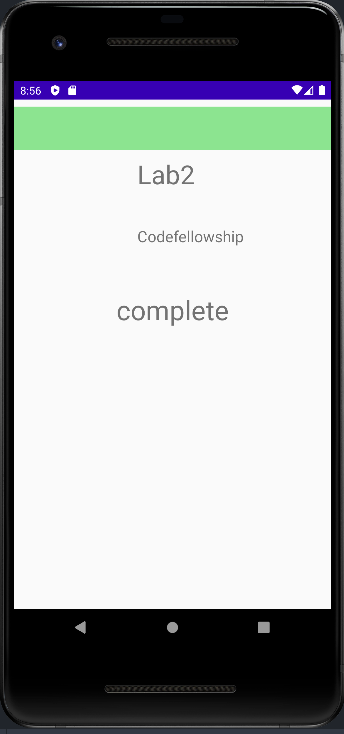
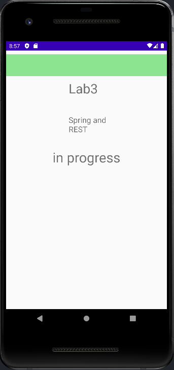

## Lab28

1- Create a Task class. A Task should have a title, a body, and a state. The state should be one of “new”, “assigned”, “in progress”, or “complete”.

2- Refactor your homepage to use a RecyclerView for displaying Task data. This should have hardcoded Task data for now.

3- you can tap on any one of the Tasks in the RecyclerView, and it will appropriately launch the detail page with the correct Task title displayed.

 

 

