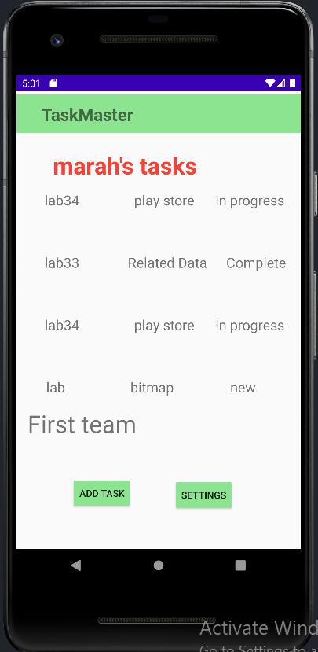

## Lab29

1- Add Task Form
Modify your Add Task form to save the data entered in as a Task in your local database.

2- Homepage
Refactor your homepage’s RecyclerView to display all Task entities in your database.

3- Detail Page
Ensure that the description and status of a tapped taskOrg are also displayed on the detail page, in addition to the title.

 

### Example of Task detail Page of a tapped taskOrg :

 

## Lab 31

Add Espresso to your application, and use it to test basic functionality of the main components of your application. For example:

* assert that important UI elements are displayed on the page
* tap on a taskOrg, and assert that the resulting activity displays the name of that taskOrg
* edit the user’s username, and assert that it says the correct thing on the homepage

 

## Lab 32
* Using the amplify add api command, create a Task resource that replicates our existing Task schema. Update all references to the Task data to instead use AWS Amplify to access your data in DynamoDB instead of in Room.

* Add Task Form
Modify your Add Task form to save the data entered in as a Task to DynamoDB.

* Homepage
Refactor your homepage’s RecyclerView to display all Task entities in DynamoDB.

 

 #####  Data is posted and displayed based on DynamoDB status:

  

### Lab 33

* Create a second entity for a team, which has a name and a list of tasks. Update your tasks to be owned by a team.

* Manually create three teams by running a mutation exactly three times in your code. (You do NOT need to allow the user to create new teams.)

* Add Task Form
* Modify your Add Task form to include either a Spinner or Radio Buttons for which team that task belongs to.

* Settings Page
* In addition to a username, allow the user to choose their team on the Settings page. Use that Team to display only that team’s tasks on the homepage.

  

  

  

  

  

